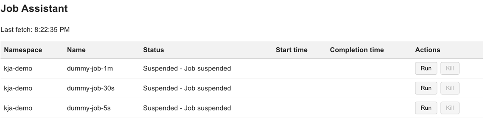
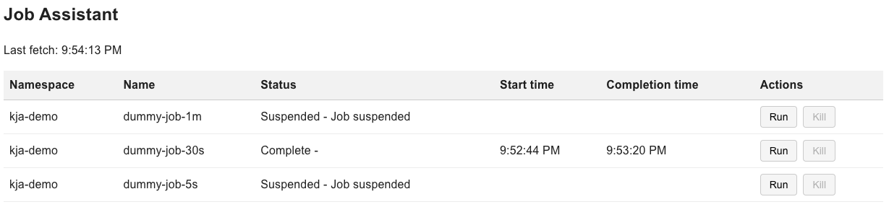

This document is intended for end user to know how to use KJA UI. 

Kubernetes Job Assistant
========================

KJA offers a simple UI to perform the following
* list KJA supported Job

> the list is refreshed every 5 seconds as long as the tab is active. Check
> "Last fetch" to know where the list was last retrieved

* run a job

> dummy-jobs-30s is running, it has a start time and can be killed

 
> dummy-jobs-30s is now complete, it has a completion time

* kill a job while it's running

> dummy-jobs-30s has a start time, no completion time and is now suspended
